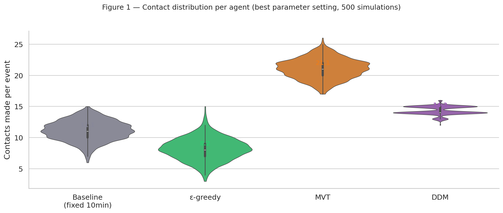
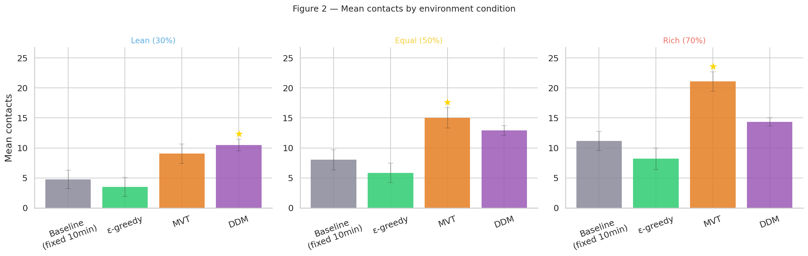
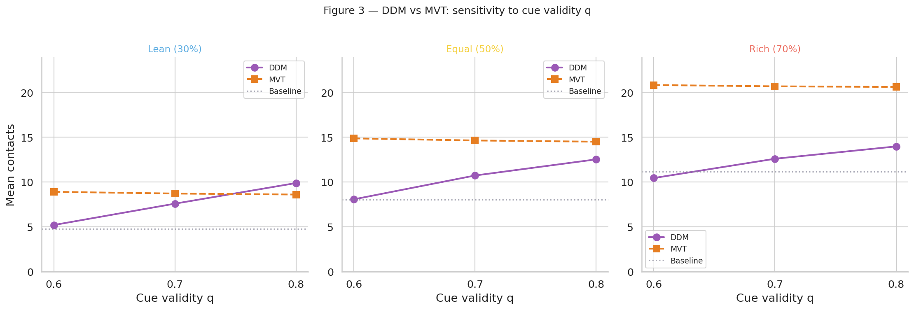
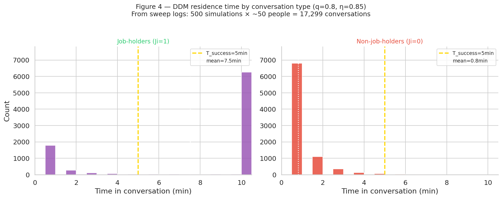
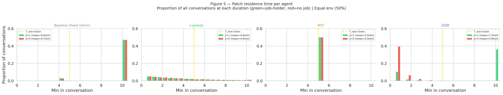
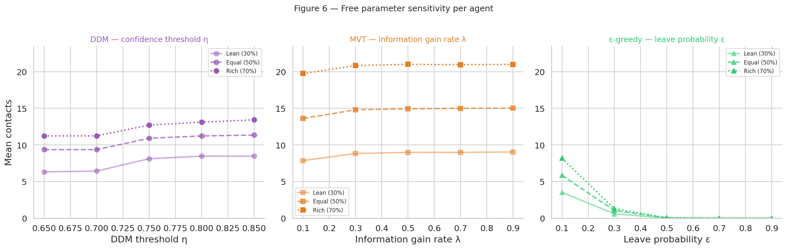
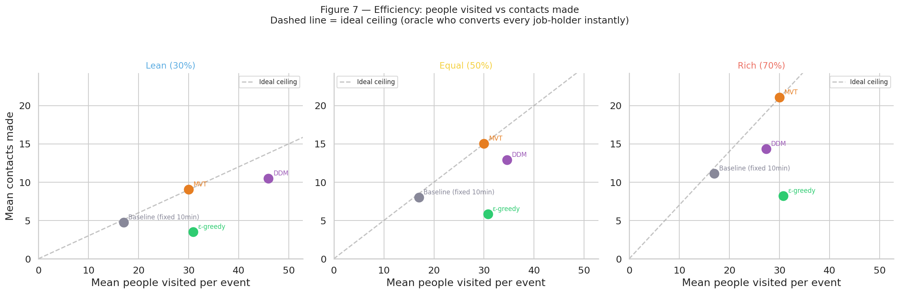
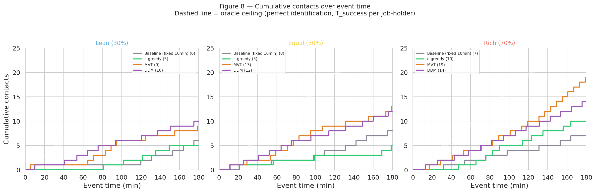
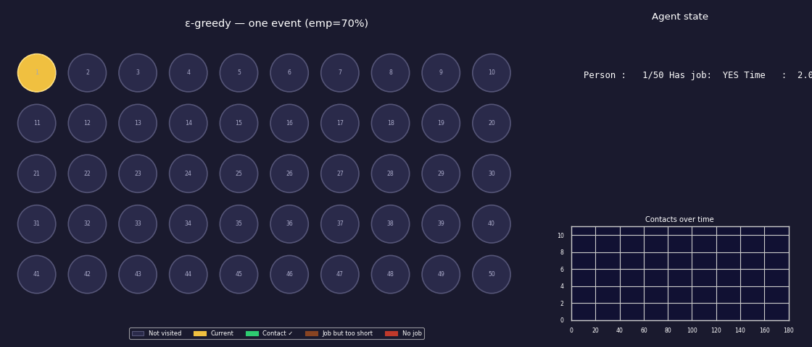

# Social Foraging in a Networking Event

This project was created as part of the final work for **NEUR1660: Neural Computation in Decision Making** at **Brown University**.

**Authors**: Aida Abkenova, Ellie Jeong, Viraj Nautiyal

## Background

Optimal foraging theory predicts how an agent should allocate limited time across “patches” to maximize reward, balancing gains against costs. A core result is **Charnov’s Marginal Value Theorem (MVT)**: leave a patch when its current reward rate falls below the environment-wide average.

Patch-leaving also has a well-studied neural signature (e.g., dACC ramping with depletion), which connects naturally to the **drift diffusion model (DDM)**: a decision variable accumulates noisy evidence over time until it reaches a threshold and triggers a switch.

Classical foraging models were developed for asocial environments, but **social foraging** emphasizes that payoffs can depend on social structure and other agents. Here, we apply single-agent foraging ideas to a social setting by framing a **job-search networking event** as a patch-leaving problem: each conversation partner is a discrete “patch” with a hidden binary resource (whether they can offer a job lead), and conversational cues provide noisy evidence about that hidden state. We then compare patch-leaving strategies (including MVT- and DDM-inspired rules) for how a networker should allocate time across conversations.

## Project structure

```text
social-foraging/
  NEUR1660_final.ipynb    # simulation + analysis notebook
  figures/               # exported figures and animations used in the writeup
  README.md
```

## Figures

### Agent illustrations

.png)
.png)
.png)
.png)

### Results snapshots










### Animations (examples)




## What’s in this repo

- `NEUR1660_final.ipynb`: simulation and analysis notebook (environment setup, condition sweeps, and results).

## Citations

- Charnov, E. L. (1976). Optimal foraging, the marginal value theorem. *Theoretical Population Biology*.
- Giraldeau, L.-A., & Caraco, T. (2000). *Social Foraging Theory*. Princeton University Press.
- Hayden, B. Y., Pearson, J. M., & Platt, M. L. (2011). Neuronal basis of sequential foraging decisions in a patchy environment. *Nature Neuroscience*.
- Blanchard, T. C., & Hayden, B. Y. (2022). [Work on foraging/patch-leaving and cingulate cortex]. *(see course/readings for full citation)*.
- Gabay, A. S., & Apps, M. A. J. (2021). [Work connecting foraging frameworks to social decision-making]. *(see course/readings for full citation)*.


